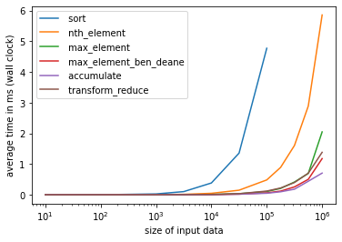
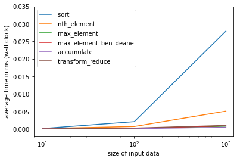
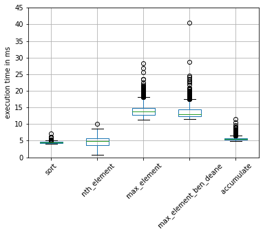
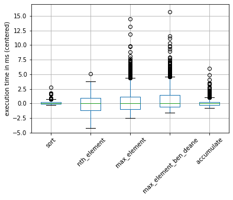

# TopTwo
Comparison of several solutions for finding the two largest integers in a vector of ints, inspired by a [twitter thread](https://twitter.com/squirrel428_/status/1516056776004800515).

Algorithms considered in rough order of increasing efficiency:
- sort: use std::sort to sort all data, then pick the last two entries
- nth_element: use std::nth_element to partition the data into a part with elements smaller or equal to the second largest element and a part with elements greater or equal to the second largest element, then pick the first two entries
- max_element: use std::max_element to find the largest element, then remove the largest element from the data, then find the largest element among the remaining elements
- max_element_ben_deane: use std::max_element to find the largest element, then swap this element with the last element in the data, then find the largest element in the data by excluding the last element
    - This approach is inspired by [Ben Deane](https://twitter.com/ben_deane), who proposed this clever solution in Episodes 75-78 of [ADSP: The Podcast](https://twitter.com/adspthepodcast).
- accumulate / reduce: use std::accumulate (for sequential execution) or std::reduce (for parallel execution) to make one pass through the data
- transform_reduce: use std::transform_reduce to split the reduction into two steps. This might be faster than reduction only for parallel execution.

# General design decisions of the experiments
- Measurement variable: average of the execution times over several random permutations of the input data
- Comparison is done for a fixed number of permutations

# Sequential algorithms
I used std::accumulate instead of std::reduce for simpler code. The binary function object that has to be passed to std::reduce is pretty involved. The lambda than is passed to std::algorithm is easy to understand. This solution is probably also faster than using std::reduce sequentially.

## Results
The following graph shows the average execution time for each size of input data and for each algorithm.

The algorithms _sort_ and _max\_element\_ben\_deane_ were much slower for larger sizes. I chose to set a cutoff size for these algorithms in order to reduce the duration of the experiment.

Clearly, _accumulate_ is the fastest algorithm.

Here is a zoomed-in graph of the same data for lower sizes of input data:

## Impact of input vector
In a separate analysis, I measured the execution time for each algorithm for 1'000 permutations. I adapted the size of the input vectors to the algorithm so that each measurement took longer than a few milliseconds. In this way, I hoped to get a reliable measurement of the execution time.

### Results
First I plotted the untouched data as a boxplot. It is hard to know if an outlier is due to the randomization of the input data or because the program was interrupted by the operating system at that time.

In this plot, the median execution time is shown as the central horizontal bar in the boxes. For most algorithms, the box is very tight compared to the median. However, _nth\_element_ seems to be affected by randomization than the other algorithms.
_Note that absolute execution times in the graphs of this section must not be compared between algorithms._

 

It is a bit difficult to judge the range of the values. I made a second plot that shows the data after I centered it around the median:

 

# Parallel algorithms
I used the execution policy std::executions::par_seq for all algorithms.

## Results
_transform\_reduce_ overtakes the two _max\_element_ algorithms but _reduce_ is still the fastest algorithm.

Surprisingly, _nth\_element_ performs *worse* when running in parallel! I currently don't have an explanation for this phenomenon.

# Environment
- WSL2 with Ubuntu 20.04 and libtbb-dev
- Compiled with:
    - g++ 9.4
    - std=C++17
    - -O3
    - -ltbb
- Machine:
    - Intel i7-1185G7 @ 3 GHz
    - 16 GB RAM

# Credits
Inspired by [Tyler Weaver](https://twitter.com/squirrel428_) and [ADSP: The Podcast](https://twitter.com/adspthepodcast) by [Bryce Adelstein Lelbach](https://twitter.com/blelbach) and [Conor Hoekstra](https://twitter.com/code_report).
