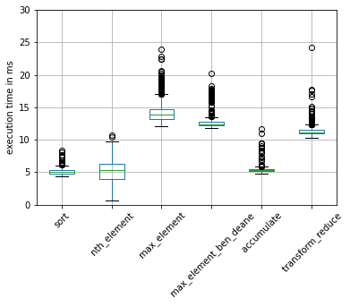
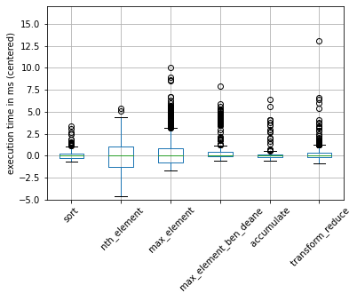

# TopTwo
 Comparison of several solutions for finding the two largest integers in a vector of ints

# Sequential algorithms
Design decisions of the experiment

- Measurement variable: average of the execution times over several random permutations of the input data
- Comparison is done for a fixed number of permutations
- Use std::accumulate instead of std::reduce for simpler code
-- The binary function object that has to be passed to std::reduce is pretty involved. The lambda than is passed to std::algorithm is easy to understand

## Results
The following graph shows the average execution time for each size of input data and for each algorithm.

The algorithms _sort_ and _max\_element\_ben\_deane_ were much slower for larger sizes. I chose to set a cutoff size for these algorithms in order to reduce the duration of the experiment.

Clearly, _accumulate_ is the fastest algorithm.

Here is a zoomed-in graph of the same data for lower sizes of input data:

## Impact of input vector
In a separate analysis, I measured the execution time for each algorithm for 1'000 permutations. I adapted the size of the input vectors to the algorithm so that each measurement took longer than a few milliseconds. In this way, I hoped to get a reliable measurement of the execution time.

### Results
First I plotted the untouched data as a boxplot. It is hard to know if an outlier is due to the randomization of the input data or because the program was interrupted by the operating system at that time.

In this plot, the median execution time is shown as the central horizontal bar in the boxes. For most algorithms, the box is very tight compared to the median. However, _nth\_element_ seems to be affected by randomization than the other algorithms.    

 

It is a bit difficult to judge the range of the values. I made a second plot that shows the data after I centered it around the median:

 

# Parallel algorithms
TBA

# Environment
- WSL2 with Ubuntu 20.04
- Compiled with:
    - g++ 9.4
    - std=C++17
    - -O3
- Machine:
    - Intel i7-1185G7 @ 3 GHz
    - 16 GB RAM

# Credits
Inspired by Tyler Weaver (twitter handle: @squirrel428_) and the ADSP: the podcast by Bryce Adelstein Lelbach and Conor Hoekstra (twitter handle: @adspthepodcast).
